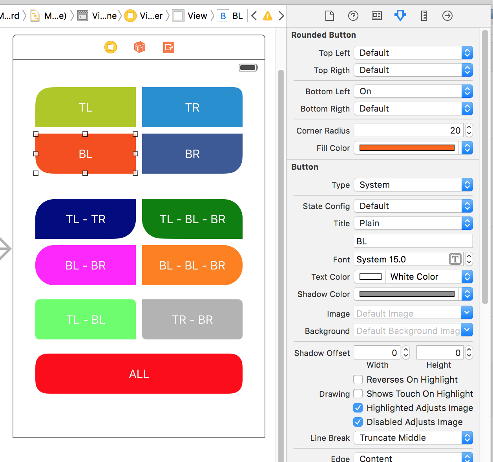

APRoundedButton [](https://raw.github.com/elpsk/APGraph-Route/master/passing.png)
===============

A simple XIB extension to make rounded custom buttons, without writing one line of code, using **IBInspectable**.

**IBInspectable** properties provide new access to an old feature: user-defined runtime attributes.  
Currently accessible from the identity inspector, these attributes have been available since before  
Interface Builder was integrated into Xcode.  
They provide a powerful mechanism for configuring any key-value coded property of an instance in a NIB, XIB, or storyboard.

Apple doc: (https://developer.apple.com/library/ios/recipes/xcode_help-IB_objects_media/Chapters/CreatingaLiveViewofaCustomObject.html)


Requirements
------------
`ARC`, `iOS 7+`, `Xcode 5`


How to use
------------

Copy in your project the files:

```
APRoundedButton.h
APRoundedButton.m
```

Next, open your *XIB* or *Storyboard*, make a button. Change *UIButton default class* with **APRoundedButton**.




That's all.  
Build and run.

#### No one line of code is needed!


MIT License
------------

The MIT License (MIT)

(c)2015 Alberto Pasca, albertopasca.it

Permission is hereby granted, free of charge, to any person obtaining a copy of this software and associated documentation files (the "Software"), to deal in the Software without restriction, including without limitation the rights to use, copy, modify, merge, publish, distribute, sublicense, and/or sell copies of the Software, and to permit persons to whom the Software is furnished to do so, subject to the following conditions:
The above copyright notice and this permission notice shall be included in all copies or substantial portions of the Software.
THE SOFTWARE IS PROVIDED "AS IS", WITHOUT WARRANTY OF ANY KIND, EXPRESS OR IMPLIED, INCLUDING BUT NOT LIMITED TO THE WARRANTIES OF MERCHANTABILITY, FITNESS FOR A PARTICULAR PURPOSE AND NONINFRINGEMENT. IN NO EVENT SHALL THE AUTHORS OR COPYRIGHT HOLDERS BE LIABLE FOR ANY CLAIM, DAMAGES OR OTHER LIABILITY, WHETHER IN AN ACTION OF CONTRACT, TORT OR OTHERWISE, ARISING FROM, OUT OF OR IN CONNECTION WITH THE SOFTWARE OR THE USE OR OTHER DEALINGS IN THE SOFTWARE.

